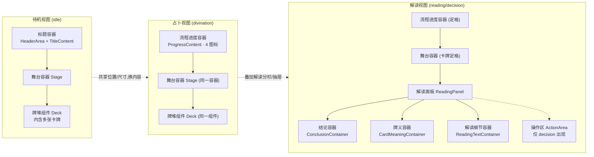
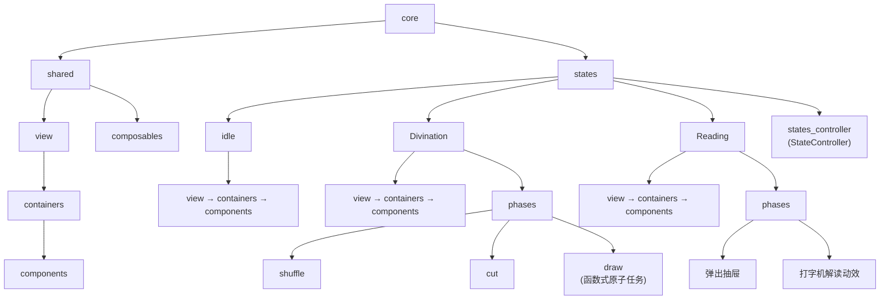
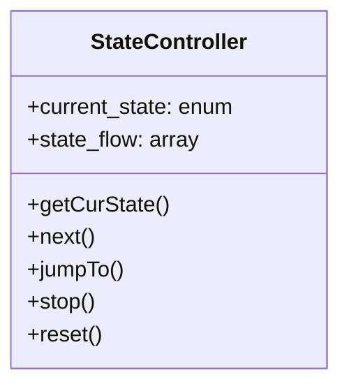

# 架构设计

## 1. 顶层导航

- 根目录结构与项目总览：[../README.md](../README.md)
- 前端 `app/`：[../app/README.md](../app/README.md)
- 后端 `server/`：[../server/README.md](../server/README.md)
- 构建编排与质量门禁 `scripts/`：[../scripts/README.md](../scripts/README.md)
- 根级工具配置 `config/`：[../config/README.md](../config/README.md)
- 状态机与视图领域定义：[prd/state.md](prd/state.md)、[prd/view.md](prd/view.md)

## 2. 架构总则

1. `app/src/` 按职责分层（各层职责见 [../app/README.md](../app/README.md)）：
   a. `core/`：底层框架/库领域核心，不依赖 `state`/`shared`。
   b. `state/`：占卜业务编排，当前过渡落点；垂直拆分（`states_controller`/`*_flow`/`phase`/`task`）后置。
   c. `tools/`：开发期工具，仅开发构建启用。
   d. `shared/`：跨页面共享（`components`/`store`/`views`）。
   e. `pages/`：`main` 主页面 + `fallback` 兜底页，由 `pages.json` 驱动（非 vue-router）。
   f. `styles/`：含 `overlay` 叠层样式。
2. 阶段是状态机，动画是阶段内可插拔内容，二者解耦。
3. 视图三层抽象：视图（逻辑页面）→ 容器（位置盒子）→ 内容（文字/动画），位置与动画解耦。

## 3. 视图骨架

标题容器与流程进度容器是两个独立容器，共享位置与尺寸，仅渲染内容不同；占卜视图与解读视图复用同一舞台容器与同一牌堆组件。

5 视图：待机视图 / 占卜视图 / 解读分栏视图（宽屏 `ReadingSplitView`）/ 解读抽屉视图（窄屏 `ReadingDrawerView`）/ 兜底视图（`FallbackView`）。

## 4. 目标架构·模块树

`core` 下分 `shared` 与 `states`，每个 state 垂直自治（自带 `view → containers → components` 与 `phases`）。

`decision`（决策阶段）折叠进 `Reading`；`Divination`/`Reading` 大写、`idle` 小写为占位，非命名规范终态。

## 5. 状态控制器 StateController

1. `current_state` 当前状态枚举；`state_flow` 状态序列数组。
2. `getCurState()` 查询当前状态。
3. `next()` 跳转下一个 state。
4. `jumpTo()` 跳转到指定 state。
5. `stop()` 暂停 state 状态切换。
6. `reset()` 重置 state 到初始状态。

现实对应物：`app/src/state/use_app_phase.ts` + `app/src/shared/store/flow.ts`。`flow.ts` 的 `DivinationPhase = 'idle' | 'divination' | 'reading' | 'decision'` 充当 `current_state`；转移为具名 helper（`startDivination` / `enterReading` / `enterDecision` / `resetToIdle` / `setPhase`），尚无通用 `state_flow` 数组、`next()` 线性迭代器与 `stop()`。

## 6. 当前代码实现

```mermaid
flowchart TD
  src["app/src"]
  src --> core["core/ 框架核心"]
  src --> state["state/ 业务编排(过渡落点)"]
  src --> tools["tools/ 开发工具"]
  src --> shared["shared/ 跨页面共享"]
  src --> pages["pages/ main + fallback"]
  src --> styles["styles/ 含 overlay"]

  core --> c_anim["animation/<br/>adapters·atoms·phases(cut/draw/fallback/fan/reveal/shuffle)<br/>pipeline·reconciler·use_playback"]
  core --> c_oth["api · deck · flow · sizing · config · utils"]

  state --> st_cmd["commands/<br/>pipeline_builder·start·replay_from_phase·skip_to_reading"]
  state --> st_play["play/<br/>click_handler·divination_rig·fan_controller"]
  state --> st_sh["shared/ use_reading_panel_controller"]
  state --> st_use["use_app_phase·use_active_view·use_phases<br/>use_overlay·use_animation_controller·use_lifecycle<br/>use_reading_controller·use_presentation·use_main_handlers"]

  shared --> sh_v["views/<br/>PlayView·ReadingSplitView·ReadingDrawerView·FallbackView"]
  shared --> sh_c["components/<br/>containers·stage-content·overlay·TypewriterText"]
  shared --> sh_s["store/<br/>tarot·flow·deck·reading·notification·theme"]
```

实测组合：`PlayView.vue` 装配 `HeaderArea` / `TitleContent` / `ProgressContent` / `Stage` / `Deck`（待机与占卜共用此视图，按阶段切容器内容）；`ReadingSplitView.vue`、`ReadingDrawerView.vue` 装配 `ReadingPanel` + `ActionArea`；`ReadingPanel.vue` 装配 `ConclusionContainer` / `CardMeaningContainer` / `ReadingTextContainer`；`use_active_view.ts` 在 `phase ∈ {reading, decision}` 时把解读视图叠加到占卜视图之上。

## 7. 目标 ↔ 现状映射

1. `states/states_controller (StateController)` ↔ `state/use_app_phase.ts` + `shared/store/flow.ts`。
2. `states/idle` + `states/Divination` 的 `view→containers→components` ↔ `shared/views/PlayView.vue` + `shared/components/{containers,stage-content}`。
3. `states/Divination/phases/{shuffle,cut,draw}` ↔ `core/animation/phases/{shuffle,cut,draw,reveal}` 构建器 + `state/commands/pipeline_builder.ts`。
4. `states/Reading/view→containers→components` ↔ `shared/views/{ReadingSplitView,ReadingDrawerView}.vue` + `shared/components/containers/{ReadingPanel,ConclusionContainer,CardMeaningContainer,ReadingTextContainer}.vue` + `state/use_reading_controller.ts`。
5. `states/Reading/phases/{弹出抽屉,打字机解读动效}` ↔ `shared/components/TypewriterText.vue` + `core/utils/typing/` + `use_active_view.ts` 的 `resultDrawerGeometry`。
6. `shared/view→containers→components` ↔ `shared/views` + `shared/components/{containers,stage-content,overlay}`；`shared/composables` ↔ 无独立目录，散落于 `state/` 与 `core/utils/`。

## 8. 差距清单（非终态项）

1. 缺 `states/{idle,Divination,Reading}` 垂直自治目录；业务编排平铺在 `state/`。
2. 缺 `states_controller` 模块；`StateController` 由 `use_app_phase` + `store/flow` 充当，缺通用 `state_flow` 数组与 `next()` / `stop()` 线性迭代语义。
3. `phases` 落在 `core/animation/phases`（动画构建）+ `state/commands`（命令编排），未归入 `states/<stage>/phases`。
4. 缺 `shared/composables` 目录；composable 散落 `state/` 与 `core/utils/`。
5. `view→containers→components` 三层在 `shared/` 部分体现，但未按 state 垂直切分（待机/占卜共用 `PlayView`）。
6. 设计图把 `decision` 折叠进 `Reading`；代码 `flow.ts` 保留独立 `decision` 阶段（四段流程），粒度待垂直拆分时对齐。
